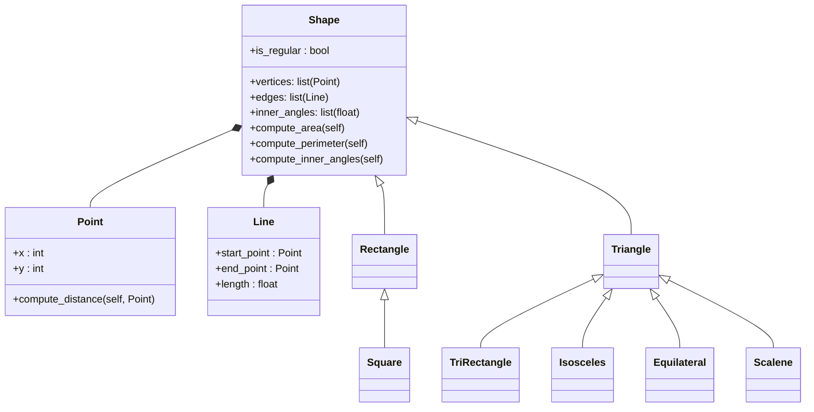

# Reto 6

1. Add the required exceptions in the Reto 1 code assigments.

- [Ejercicio_1](reto1/punto1.py)

- [Ejercicio_2](reto1/punto2.py)

- [Ejercicio_3](reto1/punto%203.py)

- [Ejercicio_4](reto1/punto4.py)

- [Ejercicio_5](reto1/punto%205.py)

---

2. In the package Shape identify at least cases where exceptions are needed (maybe when validate input data, or math procedures) explain them clearly using comments and add them to the code.

- [Solución_del_punto_2:clase.shape](Paquete.Shape/shape.py)

- [Solución_del_punto_2:clase.Triangle](Paquete.Shape/Triangle.py)

- [Solución_del_punto_2:clase.Rectangle](Paquete.Shape/Rectangle.py)

- [Prueba_del_funcionamiento:main](Paquete.Shape/main.py)

## Diagrama de clases

