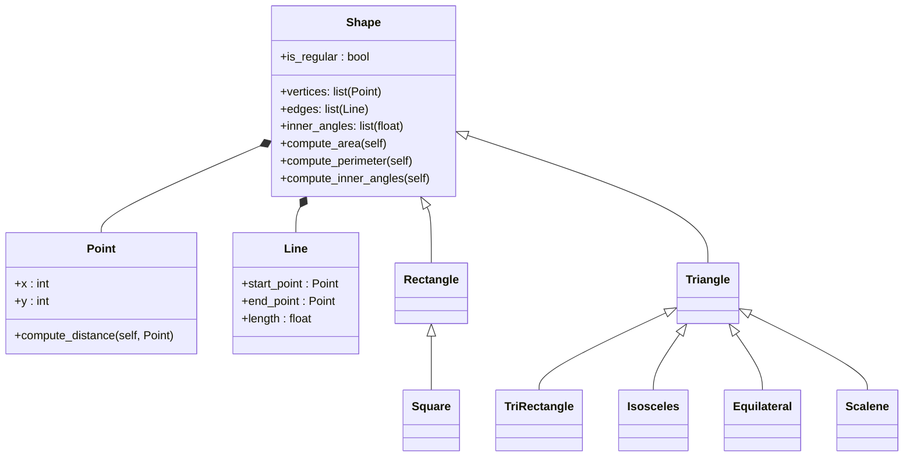

# Reto 5

---

1. Create a package with all code of class Shape, this exersice should be conducted in two ways:

- A unique module inside of package Shape

- Individual modules that import Shape in inheritates from it.

2. In the package Shape identify at least cases where exceptions are needed (maybe when validate input data, or math procedures) explain them clearly using comments and add them to the code.

[Solución_en_python](Reto-5-proyect/main.py)

---

[Volver_al_README_principal](../README.md)
